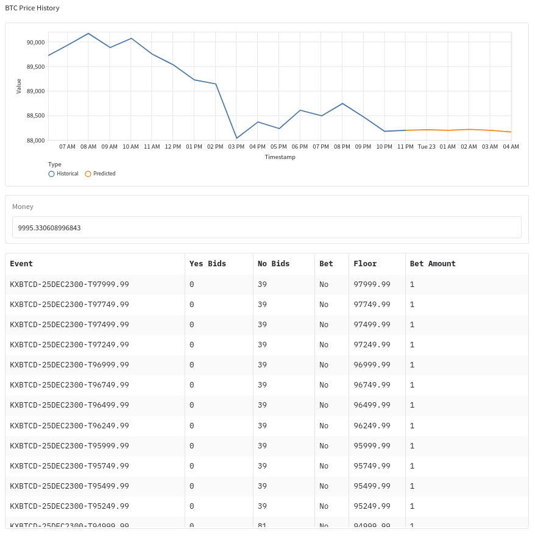

# BTC Price Prediction with RL

This project was made for educational purposes only, and should not be used as a tool for investing or gambling real money.

**Package Dependencies**

```python
stable_baselines3
gradio
pandas
schedule
cryptography
requests
```

**Setup & Activate**

Setting up the virtual environment (Linux):

```cmd
python -m venv .venv
source .venv/bin/activate
pip install -r requirements.txt
```

To activate:

```python
python main.py
```

**Model Training**
Training data & Models can be found under `/train`. PPO models have been trained through Jupyter Notebook.

**Demo**

[](link-destination-url)

More trade logs can be found under `/logs`.
